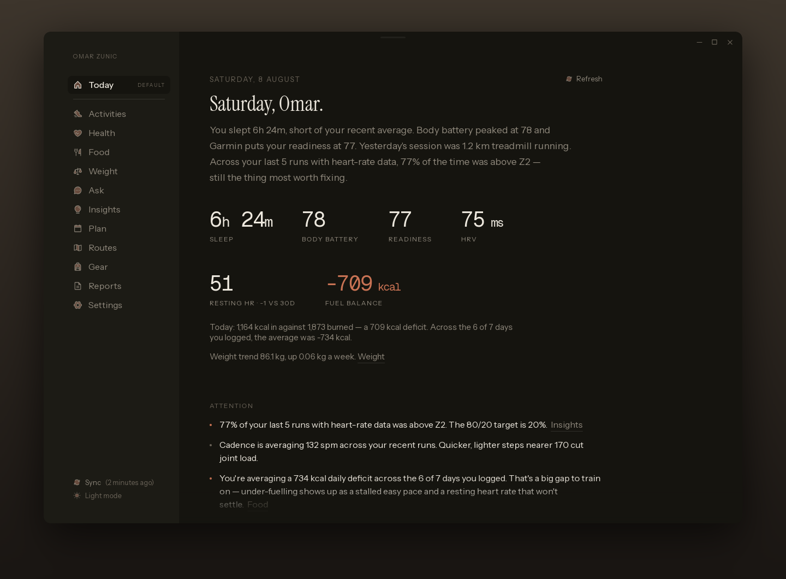
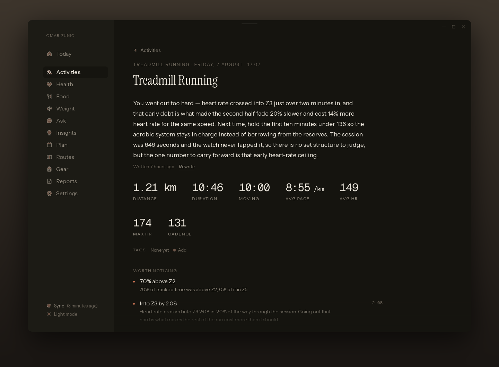
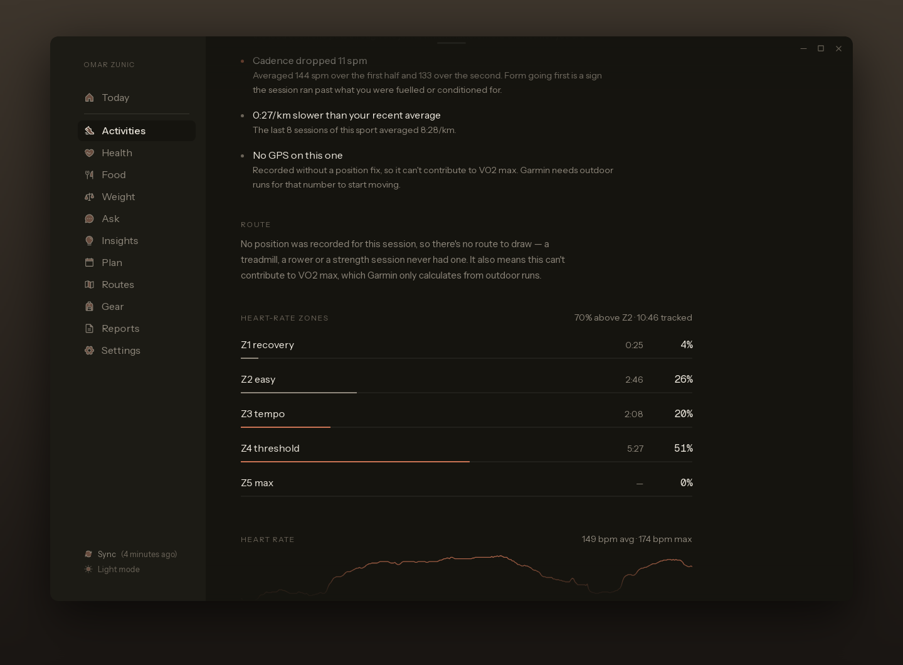
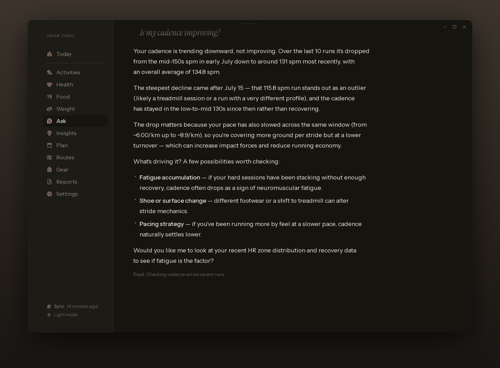
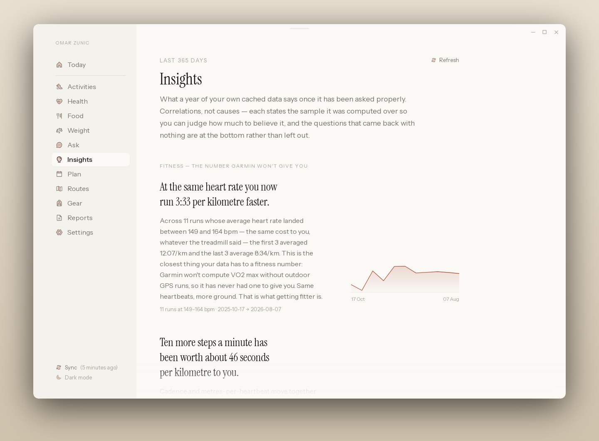
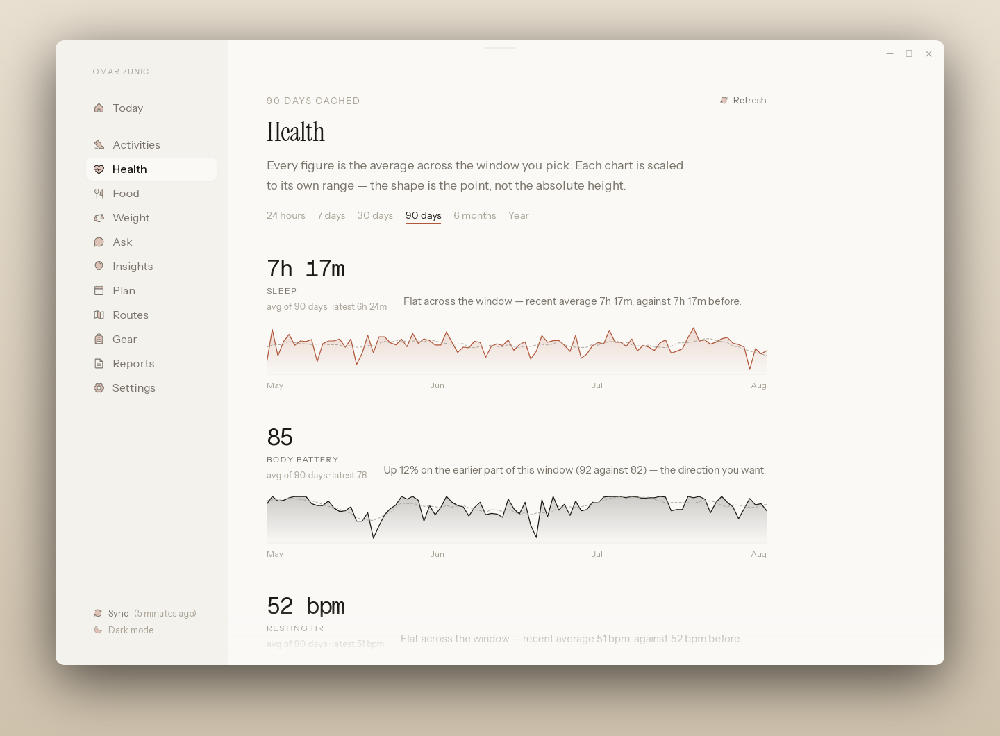
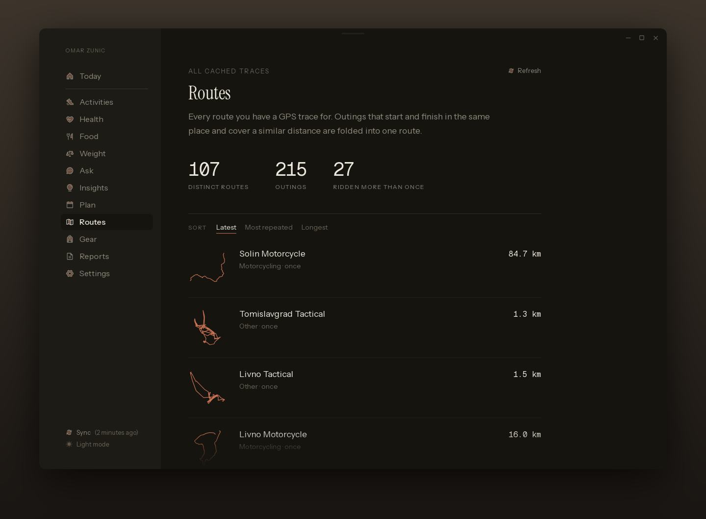

# Garmin Companion

A desktop app that pulls your Garmin Connect history onto your own machine and
answers questions about it — with an emphasis on where your heart rate actually
spent the session, which is the thing Garmin's own app buries.

Ships with an MCP server over the same data, so Claude Desktop can read it too.



## What it does

Everything is read from a local SQLite cache rather than from Garmin, so the
screens open instantly and a tool call can't stall on a network hiccup
mid-conversation. Sync is the only thing that talks to Garmin.

- **Today** — the week against your goals as rings, anything the coach has to
  say unprompted, recovery numbers, the last session in full with its zone
  breakdown, and hard-effort drift across recent runs
- **Activities / Activity** — the history, and per-lap splits and charts for
  one session
- **Health** — resting HR, HRV, sleep, stress, body battery over time
- **Food** — calories in against out, hydration
- **Ask** — questions answered by a model you choose, given only the metrics
  the question needs
- **Strength** — lifting set by set: reps, time working, rest between sets and
  the work:rest ratio. No load, because the watch doesn't record one
- **Fitness** — Garmin's own verdict rather than this app's: training status,
  acute and chronic load, the acute:chronic ratio, the monthly aerobic /
  anaerobic balance against Garmin's target ranges, race predictions, and the
  personal records
- **Insights / Reports** — correlations mined from the cache, each stating its
  sample size, and weekly summaries
- **Plan / Routes / Gear** — saved workouts, routes grouped from GPS traces,
  and shoe and bike mileage

| A session, read back to you | Where the heart rate actually went | Asked in your own words |
|---|---|---|
| [](docs/screenshots/activity-dark.png) | [](docs/screenshots/activity-zones-dark.png) | [](docs/screenshots/ask-dark.png) |

| Correlations, with their sample size | Recovery over time | Routes out of the GPS traces |
|---|---|---|
| [](docs/screenshots/insights-light.png) | [](docs/screenshots/health-light.png) | [](docs/screenshots/routes-dark.png) |

Light and dark both, on every screen. The rest of them — and the same shots
without the backdrop — are in [`docs/screenshots`](docs/screenshots).

## Where your data goes

- **Garmin credentials** live in your OS keyring, never in the database.
- **Requests to Garmin** go straight from the app to Garmin, never through a
  server of ours.
- **Chat** sends your question plus whatever a tool returned for it — a handful
  of summary rows, never the whole database and never GPS traces. Where it sends
  that depends on which of the three providers you pick:
  - **Built-in coach** (the default) — through a small proxy this project runs,
    on to a hosted model. It sees the metrics a question needs and keeps none of
    them; the code is in [`worker/`](worker) and so is what it does and doesn't
    record. This is the one option where your data touches a server you don't
    run, which is why it says so on the Ask screen and in Settings.
  - **OpenRouter** with your own key — straight from the app to OpenRouter.
  - **Ollama** on your machine — nothing leaves the computer at all.
- **Switching** is one click in Settings, in either direction, at any time.
- **The cache** is a single SQLite file you can delete. Its path is printed in
  Settings.

## Installing

Grab the installer for your platform from
[Releases](https://github.com/omznc/garmin-companion/releases/latest).

- **macOS** — `.dmg`, `aarch64` for Apple Silicon or `x64` for Intel. Drag the
  app to Applications, then clear the quarantine flag once, or macOS refuses to
  open it — right-click → Open is not enough on recent versions:

  ```sh
  xattr -dr com.apple.quarantine "/Applications/Garmin Companion.app"
  ```

- **Windows** — `-setup.exe`. SmartScreen calls it an unrecognised app: **More
  info** → **Run anyway**.
- **Linux** — `.AppImage` (`chmod +x` it, then run) or `.deb` / `.rpm`. Needs
  `webkit2gtk-4.1` from your package manager.
- **Android** — `.apk`, Android 7 or newer. Not on Play, so your phone will ask
  you to allow installing from wherever you downloaded it.

Nothing is signed with an OS vendor certificate, which is what both warnings are
about. Updates are signed with the updater's own key and work either way, so
after the first install the app updates itself from Settings.

Android updates itself too, with one difference: replacing a package is the
system's job there, so the app downloads the new version in the background and
Android asks before swapping itself out. The first time, it will send you to
turn on "Install unknown apps" for it — after that it's one tap.

### What's different on a phone

The same app and the same data, with three things worth knowing:

- **Sign-in hands over to Garmin's page and comes back.** On desktop that
  happens in a second window; a Tauri mobile app only has one, so the app itself
  navigates there and returns once Garmin issues its token. It looks like the
  app closed for a moment. It didn't.
- **Credentials are kept differently.** Desktop uses the OS keyring. Android has
  none, so the Garmin token and the OpenRouter key go into an encrypted file in
  the app's private directory, and backups are switched off so neither can be
  copied off the device by Google Drive or a phone-to-phone transfer. That is
  weaker than a keyring against a rooted device — the encryption key has to live
  beside the data, because reaching the Android Keystore needs native code this
  build doesn't have. `crates/garmin-core/src/secrets.rs` is honest about the
  details.
- **The nav is a bottom bar.** Today, Ask and Health get tabs; everything else
  is behind **More**. Press and hold a screen in that sheet and drop it on the
  tab it should replace — the phone keeps its own three, so rearranging them
  doesn't disturb the sidebar on the desktop.

## Building from source

Requires Rust, Node 22+, pnpm, and on Linux `webkit2gtk-4.1`.

```sh
cd app
pnpm install
pnpm tauri dev
```

For Android, add the SDK, NDK 28, and a JDK no newer than 21, then:

```sh
source scripts/android-env.sh
cd app && pnpm tauri android build --apk --debug
```

The env script explains what it sets and why — see
[RELEASING.md](RELEASING.md#android) for the sharp edges, of which there are
three.

Connect an account in Settings, or adopt tokens from an existing
[`garminconnect`](https://github.com/cyberjunky/python-garminconnect) install in
one click if you have one.

### The coach

The one part of the app that speaks first. It looks at the week against the
goals you set in Settings and decides whether anything is worth raising — most
days nothing is, which is the design rather than a failure. What it does raise
carries the numbers behind it, and one nudge a day can become a system
notification.

On Android that notification arrives without the app running. Nothing evaluates
the rules in the background, so instead the next few days are queued with the
system in advance, from a plan rebuilt on every launch and after every sync.
Anything queued beyond the first day says in its own text when it was worked
out, because by then it is reporting the last thing the cache was told rather
than something current — and after those days the phone goes quiet until the app
is opened again. Desktop has no way to queue a notification at all, so there it
is shown on launch, at most once a day.

The rules are stateless and live in `crates/garmin-core/src/coach.rs`; what a
nudge has already said, and for how many days, lives in the cache.

There's also a headless sync, useful for a cron job:

```sh
cargo run -p garmin-core --bin sync -- 30        # last 30 days
cargo run -p garmin-core --bin sync -- 365 --full
```

## The MCP server

`crates/garmin-mcp` exposes the same queries as MCP tools — zone breakdowns,
drift, cadence, recovery, nutrition, weight, tags, workouts, routes, strength
sessions, personal records, Garmin's training status, the coach, and the full
per-session analysis. It shares the client, token store and cache with the app,
so an answer given in Claude Desktop and one given in the app's Ask screen come
from identical code.

```sh
cargo build --release -p garmin-mcp
./target/release/garmin-mcp import   # adopt existing tokens, once
./target/release/garmin-mcp coach    # what the coach would say today
```

`manifest.json` describes it for Claude Desktop.

## Layout

| Path | What's in it |
|---|---|
| `crates/garmin-core` | Garmin client, token store, SQLite cache, sync, queries |
| `crates/garmin-mcp` | MCP server over `garmin-core` |
| `app/src-tauri` | Tauri commands, chat and tool dispatch |
| `app/src` | React frontend |

The two Rust binaries share `garmin-core` so they can never drift onto
different versions of the Garmin client.

## Releases

See [RELEASING.md](RELEASING.md). Tagging `v*` builds installers for macOS
(Apple Silicon and Intel), Windows, Linux and Android, and the desktop app
updates itself from Settings.

## Licence

MIT. See [LICENSE](LICENSE).
